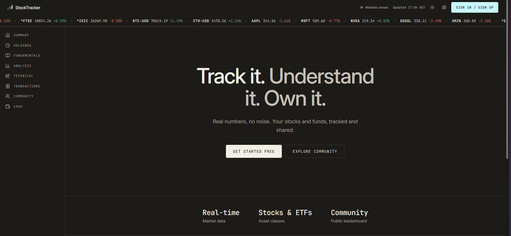
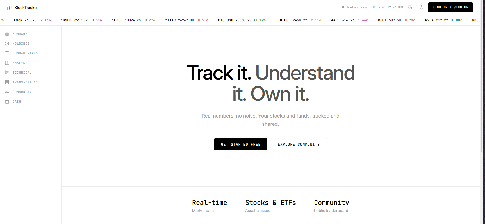
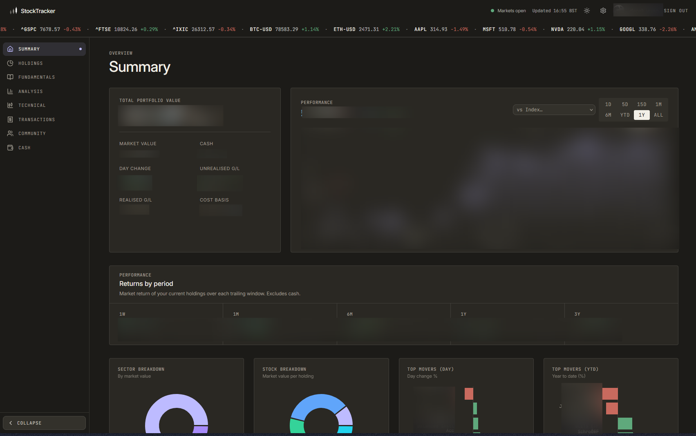
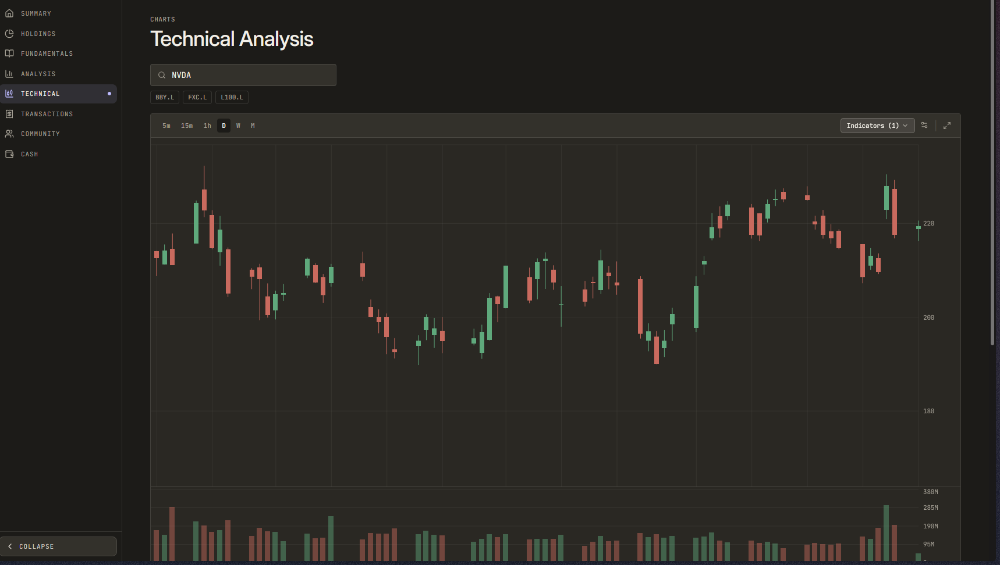

# StockTracker

Simple Dashboard for Tracking Your Stock Portfolio with all of the information you need in one place.
> **Live:** [stocktracker.derekyuan.co.uk](https://stocktracker.derekyuan.co.uk)

<table>
  <tr>
    <td></td>
    <td></td>
  </tr>
</table>

<table>
  <tr>
    <td></td>
    <td></td>
  </tr>
</table>

---

## What it does

Most portfolio apps either oversimplify (just show me a green number) or overcomplicate (spreadsheet hell). This one sits in the middle — it tracks exactly what you bought and when, calculates realised/unrealised P&L per lot, pulls live quotes and fundamentals, and shows a TradingView-style chart for any ticker you hold or want to look up.

## Tech stack

| Layer | What |
|---|---|
| Framework | [TanStack Start](https://tanstack.com/start) (React 19, file-based routing) |
| Styling | Tailwind CSS 4, Radix UI primitives |
| Charts | Recharts |
| Database | [Turso](https://turso.tech) (hosted SQLite) + Drizzle ORM |
| Auth | [Better Auth](https://better-auth.com) + Google OAuth |
| AI | Anthropic Claude SDK (optional — AI portfolio insights) |
| Deployment | Vercel (Nitro preset) |

---

## Getting started

### Prerequisites

- [Node.js](https://nodejs.org) 20+
- [Bun](https://bun.sh) (package manager — faster installs)
- A [Turso](https://turso.tech) account (free tier is fine)
- Google OAuth credentials (for login)

### 1. Clone and install

```bash
git clone https://github.com/yourusername/stocktracker.git
cd stocktracker
bun install
```

### 2. Set up environment variables

```bash
cp .dev.vars.example .dev.vars
```

Open `.dev.vars` and fill in the values. The comments in the file explain where to get each one. The three required ones to boot the app are:

- `TURSO_DATABASE_URL` + `TURSO_AUTH_TOKEN` — from [turso.tech](https://turso.tech)
- `BETTER_AUTH_SECRET` — any 32-character random string (`openssl rand -base64 32`)
- `BETTER_AUTH_URL` — `http://localhost:8080` for local dev
- `GOOGLE_CLIENT_ID` + `GOOGLE_CLIENT_SECRET` — from [Google Cloud Console](https://console.cloud.google.com/apis/credentials)

### 3. Run database migrations

```bash
bun run db:migrate
```

### 4. Start the dev server

```bash
bun run dev
```

Open [http://localhost:8080](http://localhost:8080). Sign in with Google, add a holding, and start tracking.

---

## Database commands

```bash
bun run db:generate   # generate a new migration after schema changes
bun run db:migrate    # apply pending migrations
bun run db:studio     # open Drizzle Studio (visual DB explorer)
bun run db:reset      # wipe and re-migrate (destructive — local only)
```

---

## Deploying to Vercel

1. Push to GitHub.
2. Import the repo in [Vercel](https://vercel.com/new).
3. Add all environment variables from `.dev.vars` in the Vercel dashboard. Change `BETTER_AUTH_URL` to your production domain (e.g. `https://stocktracker.example.com`).
4. Deploy. Vercel auto-detects the Nitro/Vite config.

For the Google OAuth redirect URI, add `https://yourdomain.com/api/auth/callback/google` in the Google Cloud Console.

---

### Project structure

```
src/
  routes/       # Pages (file-based routing via TanStack Router)
  components/   # Shared UI components
  server/
    api/        # API route handlers
    db/         # Drizzle schema + client
    auth.ts     # Better Auth config
    market/     # Yahoo Finance data fetching + caching
    services/   # Business logic (portfolio math, FX, etc.)
  fns/          # TanStack Start server functions
  lib/          # Shared utilities
drizzle/
  migrations/   # SQL migration files
packages/
  api-contracts/  # Shared TypeScript types
  shared/         # Portfolio math, formatting helpers
scripts/          # DB maintenance scripts
```

---

## Related

- **Mobile app:** [github.com/derekyuan1000/StockTracker-Mobile](https://github.com/derekyuan1000/StockTracker-Mobile) — iOS and Android companion with home screen widget and biometric unlock

---

## Contributing

See [CONTRIBUTING.md](CONTRIBUTING.md) for code style, conventions, and how to submit changes.

---

## License

MIT — do whatever you want, just don't hold me responsible if your portfolio goes to zero.
